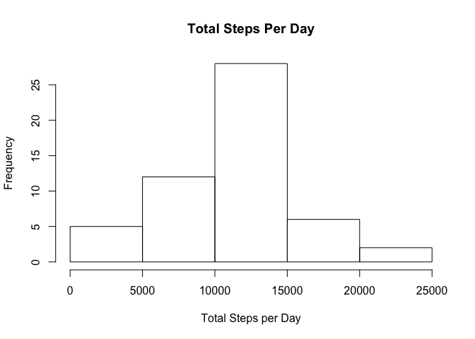
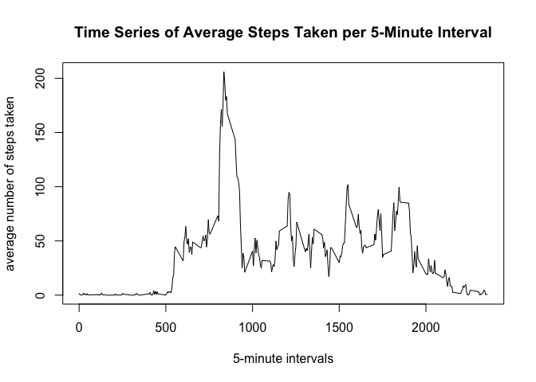
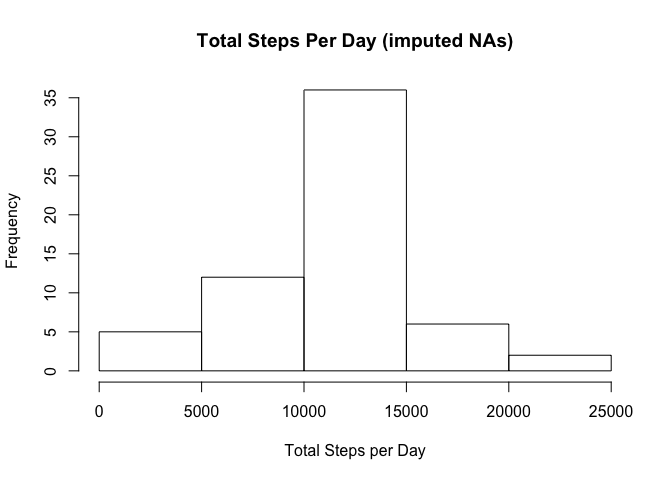
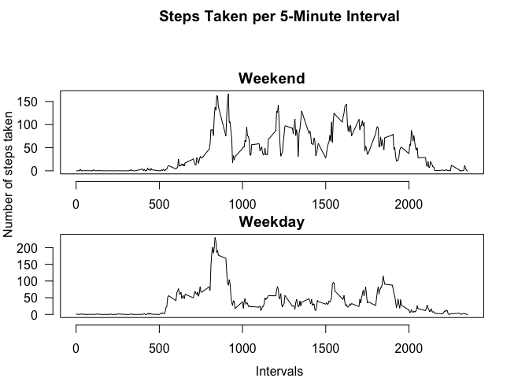

## Loading and preprocessing the data

Open the data using the commands "unz" (to red the zip file) and "read.csv" (to read the activity.csv file within the zip file). Then, use the "as.Date" command to transform variable "date" from character to time format and create variable "date2".


```r
data <- read.csv(unz("activity.zip", "activity.csv"))
data$date2 <- as.Date(data$date, format = "%Y-%m-%d")
```

## What is mean total number of steps taken per day?


```r
# Aggregating data and labeling columns
total <- aggregate(data$steps,list(data$date2),sum)
colnames(total) <- c("dates", "steps.total")

# Calculating and storing the mean and the median
meantotalsteps <- mean(total$steps.total, na.rm = TRUE)
mediantotalsteps <- median(total$steps.total, na.rm = TRUE)
```

The new data frame "total" has two variables: "dates", referring to the dates where the data were collected, and "steps.total", referring to the total of stems in each date.  
The histogram below shows the distribution of total steps per day:


```r
# Histogram
hist(total$steps.total, main = "Total Steps Per Day", xlab = "Total Steps per Day")
```

<!-- -->

The mean of the total number of steps taken per day is 1.0766189\times 10^{4}  
The median of the total number of steps taken per day is 10765  


## What is the average daily activity pattern?

The following time series plot shows the average number steps taken in each 5-minute interval across the days observed.

```r
#Aggregating data and labeling columns
meaninterval <- aggregate(data$steps,list(data$interval),mean, na.rm = TRUE)
colnames(meaninterval) <- c("interval", "steps.mean")

# Ploting the time series
plot(meaninterval$interval, meaninterval$steps.mean, type = "l", xlab = "5-minute intervals", ylab = "average number of steps taken", main = "Time Series of Average Steps Taken per 5-Minute Interval")
```

<!-- -->

```r
# Obtaining the interval with the largest average of steps across days
maxinterval <- meaninterval$interval[meaninterval$steps.mean == max(meaninterval$steps.mean)]
```

The the 5-minute interval with the maximum number of steps is `maxinterval` 

## Imputing missing values


```r
# Obtaining the number of missing values in the variable "steps"
nas <- sum(is.na(data$steps))

# Imputing missing values using the average number of steps of the corresponding 5-minute interval (as calculated in "maininterval"). The framework "dataclean" contains the data with the imputed values included
dataclean <- data
for(i in 1:17568){                                                                      # loop based on the number of rows
        if(is.na(dataclean[i,"steps"])){                                                # evaluate if "steps" is missing at a given row
                int <- dataclean[i, "interval"]                                    # if "steps" is missing, then save the corresponding 5-minute interval
                imp <- meaninterval$steps.mean[meaninterval$interval == int]       # extract the average of the same 5-minute interval from "meaninterval"
                dataclean[i,"steps"] <- imp                                             # replace the missing value with the average of the corresponding interval
        } else {
                next() # if "steps" is NOT missing, then pass
        }
}

# Aggregating data and labeling columns
total2 <- aggregate(dataclean$steps,list(dataclean$date2),sum)
colnames(total2) <- c("dates", "steps.total")

# Calculating the mean and median of steps
meantotalsteps2 <- mean(total2$steps.total, na.rm = TRUE)
mediantotalsteps2 <- median(total2$steps.total, na.rm = TRUE)
```

The original data frame contains `nas` missing cases in the variable "steps". For the "dataclean" data frame, these missing values have been imputed using the average number of steps for the corresponding 5-minute interval (as calculated for the previous step).  

The histogram below shows the new distribution of total steps per day:


```r
# Histogram
hist(total2$steps.total, main = "Total Steps Per Day (imputed NAs)", xlab = "Total Steps per Day")
```

<!-- -->

The new mean of the total number of steps taken per day is 1.0766189\times 10^{4}  
The new median of the total number of steps taken per day is 1.0766189\times 10^{4}  

As the histogram and the new measurements show, the imputed data changed the distribution, increasing the concentration of observations with middle-range number of steps. The mean is not affected, and the new median is now eaqual to the mean.

## Are there differences in activity patterns between weekdays and weekends?

There are different patterns. As the following graph shows, during weekends, the average number of steps is genearlly higher and more evenly distributed across different intervals, although the maximum average number of steps per interval is lower. During weekdays, the largest averages of steps are concentrated between the 500 and 1000 intervals.


```r
# Generating "weekend" factor variable, indicating whether the data were taken in a weekday or a weekend
dataclean$weekdays <- weekdays(dataclean$date2)
dataclean$weekend <- NA

for(i in 1:17568){
        if(dataclean[i,"weekdays"] == "Saturday" | dataclean[i,"weekdays"] == "Sunday") {
                dataclean[i, "weekend"] <- "Weekend"
        } else {
                dataclean[i, "weekend"] <- "Weekday"
        }
}

dataclean$weekend <- as.factor(dataclean$weekend)

# Aggregating the data and labeling columns
meanweek <- aggregate(dataclean$steps,list(dataclean$interval, dataclean$weekend),mean, na.rm = TRUE)
colnames(meanweek) <- c("interval","weekend", "steps.mean")

# Separating the aggregated data into two databases, one for Weekdays and another for Weekends
meanweekdays <- meanweek[meanweek$weekend == "Weekday",]
meanweekends <- meanweek[meanweek$weekend == "Weekend",]

# Generating graphs
par(mfrow = c(2,1), mar = c(0, 0, 4, 1), oma=c(4, 4, 2, 2), las=1)
plot(meanweekends$interval, meanweekends$steps.mean, type = "l", main = "Weekend", line = 0.5, xlab = "", ylab = "")
```

```
## Warning in plot.window(...): "line" is not a graphical parameter
```

```
## Warning in plot.xy(xy, type, ...): "line" is not a graphical parameter
```

```
## Warning in box(...): "line" is not a graphical parameter
```

```r
plot(meanweekdays$interval, meanweekdays$steps.mean, type = "l", main = "Weekday", line = 0.5, xlab = "", ylab = "")
```

```
## Warning in plot.window(...): "line" is not a graphical parameter
```

```
## Warning in plot.xy(xy, type, ...): "line" is not a graphical parameter
```

```
## Warning in box(...): "line" is not a graphical parameter
```

```r
title("Steps Taken per 5-Minute Interval", outer=TRUE)
mtext("Intervals", 1, 3, outer=TRUE)
mtext("Number of steps taken", 2, 3, outer=TRUE, las=0)
```

<!-- -->

```r
dev.off()
```

```
## null device 
##           1
```
